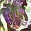

# NTHU Deep Learning Competitions

Implementations and reports for three NTHU DataLab deep-learning competitions: structured text prediction, object detection, and text-conditioned image generation. The repository records the full experimental workflow in Jupyter notebooks, including preprocessing, model design, training, evaluation, and submission generation.

## Results


## Competitions

### Competition 1 — Text feature engineering

Binary popularity prediction from article HTML and metadata.

- Cleans and parses article HTML with Beautiful Soup and regular expressions.
- Extracts channel, publication time, weekday, hour, age, and topic tags.
- Uses five-fold smoothed target encoding for the channel feature without leaking validation labels.
- Builds sparse topic bag-of-words features with lemmatization and stop-word removal.
- Trains a LightGBM classifier and evaluates it with five-fold ROC-AUC.
- Reported CV AUC: `0.60532 ± 0.00373`; public/private scores: `0.60729` / `0.59658`.

Notebook: [Competition1/DL_comp1_114062516_report.ipynb](Competition1/DL_comp1_114062516_report.ipynb)

### Competition 2 — YOLOv1 object detection

A TensorFlow/Keras YOLOv1 detector for PASCAL VOC images.

- Uses ImageNet-pretrained DenseNet121 as a feature extractor with partial fine-tuning.
- Implements a custom YOLO detection head and loss.
- Investigates class imbalance through rare-class oversampling.
- Compares horizontal flip/color jitter, affine transforms, and Mosaic augmentation.
- Adds multi-object post-processing with confidence filtering and non-maximum suppression.
- Documents the effect of correcting the class-loss mask and tuning NMS thresholds.

Notebook: [Competition2/DL_comp2_04_report.ipynb](Competition2/DL_comp2_04_report.ipynb)

### Competition 3 — Reverse image captioning

Text-to-image generation conditioned on flower descriptions.

- Encodes captions with the pretrained Universal Sentence Encoder and caches embeddings.
- Trains a WGAN-GP with a FiLM-conditioned generator and text-conditioned discriminator.
- Uses gradient penalty, TTUR learning rates, and a 3:1 discriminator/generator update ratio for stability.
- Compares the GAN approach with a latent diffusion model.
- Uses best-of-N inference: generate several candidates and select one with the discriminator.

Model notebook: [Competition3/DL_comp3_04_model.ipynb](Competition3/DL_comp3_04_model.ipynb)<br>
Report notebook: [Competition3/DL_comp3_04_report.ipynb](Competition3/DL_comp3_04_report.ipynb)

Example generated images:

<p align="center">
  
  
  
</p>

## Repository structure

```text
Competition1/   Text/tabular feature engineering and LightGBM
Competition2/   YOLOv1 object detection experiments
Competition3/   WGAN-GP model, report, and generated inference images
```

## Running the notebooks

1. Create a Python environment and launch JupyterLab or open the notebooks in Google Colab.
2. Install the imports used by the selected notebook. Major dependencies include TensorFlow, TensorFlow Hub, LightGBM, scikit-learn, pandas, NumPy, NLTK, Beautiful Soup, OpenCV, and Matplotlib.
3. Download the corresponding course competition dataset and place it at the paths referenced in the notebook.
4. Run the notebook from top to bottom, updating dataset/checkpoint paths when necessary.

GPU acceleration is strongly recommended for Competitions 2 and 3.

## Reproducibility notes

- Course datasets, pretrained checkpoints, and generated intermediate files are not all included because of their size and distribution terms.
- The notebooks preserve experiment code and reported metrics, but exact leaderboard reproduction depends on the original data split, package versions, random seeds, and hardware.
- Competitions 2 and 3 were team projects; team membership is documented in their report notebooks.
